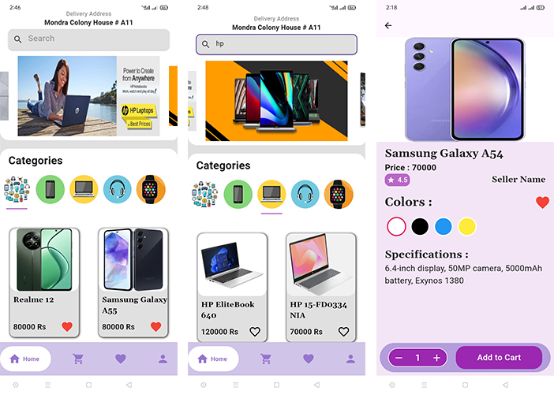
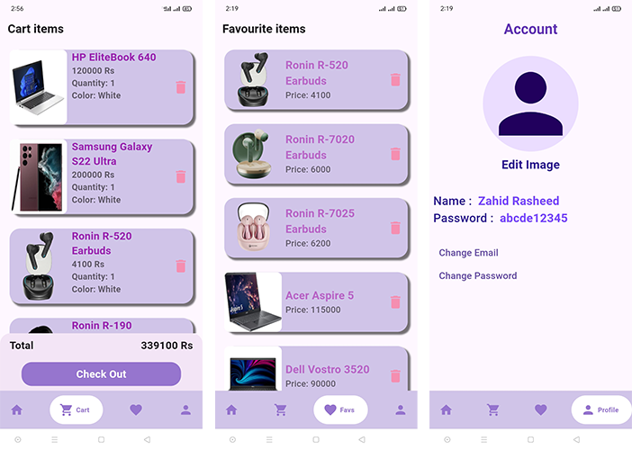

# 🛒 E-Commerce App  

A modern e-commerce app built with **Flutter**, **Firebase**, and **Provider** for smooth performance and seamless shopping experience.  

- 🛍 **Categorized Product Browsing** – Easily explore gadgets by categories.  
- 🔍 **Search Functionality** – Find products quickly by name or category.  
- 🛒 **Cart Management** – Add products to your cart & proceed to checkout.  
- ❤️ **Favorites** – Save your favorite items for later.  
- 🔐 **Firebase Authentication** – Secure login & registration with Firebase.  
- 📦 **Firestore Integration** – Store & manage data seamlessly with Firestore.  
- ⚡ **State Management with Provider** – Smooth and efficient app state handling.  

## 🏗 Tech Stack  

- **Flutter** – Cross-platform UI framework  
- **Dart** – Programming language  
- **Firebase Authentication** – User authentication  
- **Firestore** – Cloud database  
- **Provider** – State management  

# Screenshots 
  //
  ###
  // 

# Disclaimer
This is a simple e-commerce application named Z-Tech Electronics created as a demo project. The app features various electronic gadgets and integrates Firebase services for managing authentication, cart, and favorites. It is designed for learning purposes and may not be suitable for production environments without further enhancements and security improvements.

  
